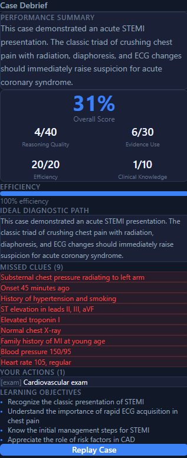
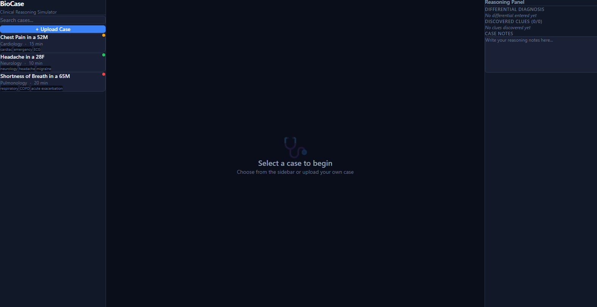
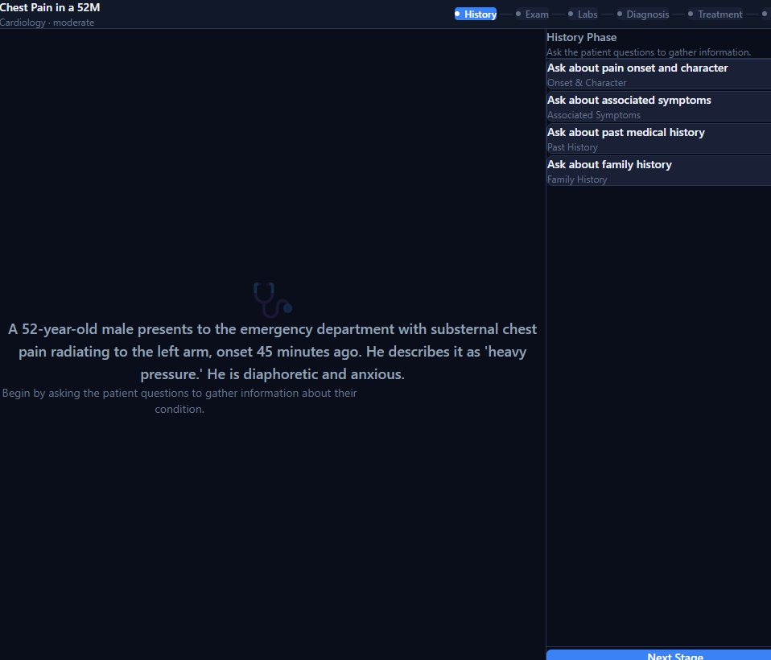

# BioCase

Desktop clinical reasoning simulator. Practice diagnosing patients through interactive cases with history-taking, physical exam, labs, and structured debriefs.

## Features

- **Interactive patient cases** — ask questions, order exams, review labs, and reach a diagnosis
- **AI-powered patient responses** — NVIDIA NIM generates natural patient dialogue in real time
- **Scoring & debrief** — get scored on reasoning quality, efficiency, evidence use, and clinical knowledge
- **Custom case upload** — teachers can upload TXT, MD, or PDF files; AI extracts structured case data
- **Case editor** — review and edit extracted cases before saving
- **Progress tracking** — attempts saved locally, best scores shown per case

## Screenshots

| Case Selection | Patient Interaction | Debrief |
|---|---|---|
|  |  |  |

## Getting Started

### Prerequisites

- [Node.js](https://nodejs.org/) 18+
- [Rust](https://www.rust-lang.org/tools/install) (for Tauri)
- [Visual Studio Build Tools](https://visualstudio.microsoft.com/visual-cpp-build-tools/) (Windows)
- NVIDIA NIM API key from [build.nvidia.com](https://build.nvidia.com)

### Setup

```bash
# Clone
git clone https://github.com/YOUR_USERNAME/biocase.git
cd biocase

# Install dependencies
npm install

# Add your API key
echo "VITE_NIM_API_KEY=your_key_here" > .env

# Run in dev mode
npm run tauri dev

# Build for production
npm run tauri build
```

## Tech Stack

| Layer | Technology |
|---|---|
| Desktop shell | Tauri 2 (Rust) |
| UI | React 19, TypeScript, Tailwind CSS 4 |
| State | Zustand |
| AI | NVIDIA NIM (nemotron-super-49b-v1.5) |
| PDF parsing | pdf-parse |
| Storage | localStorage |

## Project Structure

```
biocase/
├── src/
│   ├── components/          # UI components
│   │   ├── ActionPanel.tsx      # Stage-specific actions
│   │   ├── CaseEditor.tsx       # Form editor for custom cases
│   │   ├── CaseList.tsx         # Sidebar case browser
│   │   ├── CaseUploadModal.tsx  # File upload → AI extraction
│   │   ├── DebriefPanel.tsx     # Score & feedback display
│   │   ├── PatientResponse.tsx  # Patient conversation view
│   │   ├── ReasoningPanel.tsx   # Differential, clues, notes
│   │   └── StageIndicator.tsx   # Progress bar
│   ├── features/
│   │   ├── case/seedCases.ts    # Built-in case definitions
│   │   └── engine/CaseEngine.ts # Case state machine
│   ├── lib/
│   │   ├── caseExtractor.ts     # NIM-based case extraction
│   │   ├── fileParser.ts        # TXT/MD/PDF file reading
│   │   ├── nim.ts               # NVIDIA NIM API client
│   │   └── persistence.ts       # localStorage CRUD
│   ├── stores/caseStore.ts      # Zustand state management
│   └── types/case.ts            # TypeScript type definitions
├── src-tauri/               # Tauri (Rust) desktop shell
├── PRD.md                   # Product requirements
└── PLAN.md                  # Build plan
```

## How It Works

1. **Select a case** from the sidebar (3 built-in cases or your own custom uploads)
2. **Investigate** — move through history, exam, and labs stages by clicking actions
3. **Diagnose** — select your working diagnosis from the differential
4. **Treat** — choose your management plan
5. **Debrief** — review your score, missed clues, and AI-generated feedback

## Custom Cases

Teachers can upload case files for students to practice:

1. Click **"+ Upload Case"** in the sidebar
2. Drop a `.txt`, `.md`, or `.pdf` file containing a clinical case description
3. AI extracts structured data (diagnosis, clues, actions, scoring rubric)
4. Review and edit the extracted case in the form editor
5. Save — the case appears in the sidebar with a **CUSTOM** badge

## License

MIT — see [LICENSE.txt](LICENSE.txt)
